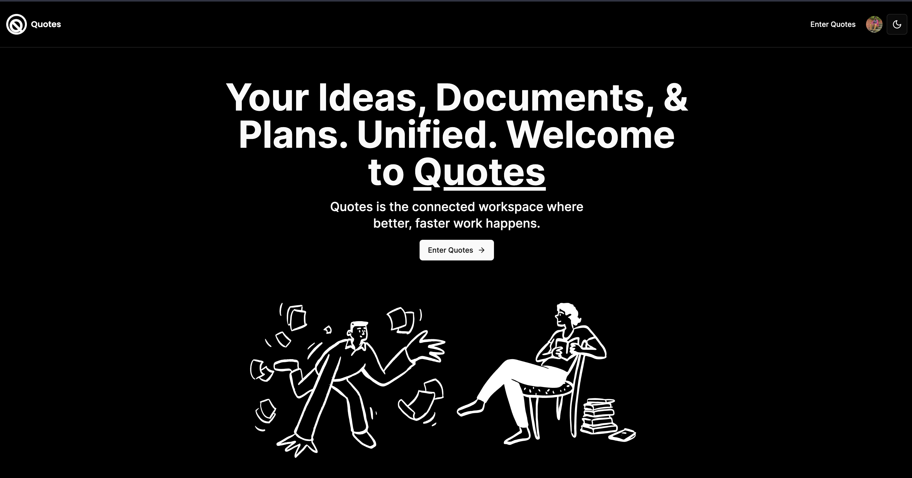

# Quotes - A note taking app build with Next.js

This is a [Next.js](https://nextjs.org/) project bootstrapped with [`create-next-app`](https://github.com/vercel/next.js/tree/canary/packages/create-next-app).



## Getting Started

First, clone the project from GitHub:

```bash
git clone https://github.com/kisyular/quotes.git
```

Navigate into the project directory:

```bash
cd your_project
```

Install the dependencies:

```bash
npm install
```

Next, you need to set up your environment variables. Copy the `.env.local` file:

```bash
cp .env.local.example .env.local
```

Open `.env.local` and replace the following values with your own:

-   `CONVEX_DEPLOYMENT`: This is your Convex deployment URL. You can get this by signing up at [Convex](https://convex.dev/).
-   `NEXT_PUBLIC_CONVEX_URL`: This is the public URL for your Convex deployment.
-   `NEXT_PUBLIC_CLERK_PUBLISHABLE_KEY`: This is your Clerk publishable key. You can get this by signing up at [Clerk](https://clerk.dev/).
-   `CLERK_SECRET_KEY`: This is your Clerk secret key.
-   `EDGE_STORE_ACCESS_KEY`: This is your EdgeStore access key. You can get this by signing up at [EdgeStore](https://edgestore.dev/).
-   `EDGE_STORE_SECRET_KEY`: This is your EdgeStore secret key.

Finally, run the development server:

```bash
npm run dev
```

Open [http://localhost:3000](http://localhost:3000) with your browser to see the result.
